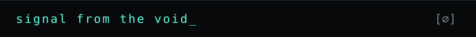

  

**研究 AI 的安全边界，构建从线索到证据的工具。**  
我是 nullinject / Void Prompt。关注提示注入、Agent 信任边界与 AI 驱动的内存取证。

  

### [LLM Security Research ↗](https://github.com/nullinject/llm-security-research)

**当输入越过信任边界。**  
LLM 应用与工具生态的安全案例：Prompt Injection、RAG 投毒、Skill 供应链。

`RESEARCH` `AI SECURITY`

### [MemoryAI Forensics ↗](https://github.com/nullinject/MemoryAI-Forensics-Showcase)

**从内存线索，到可复盘的证据。**  
结合 AI 工作流、Volatility 与 YARA 的内存取证平台，关注证据交叉验证与报告输出。

`SHOWCASE` `DIGITAL FORENSICS`

公开仓库展示系统能力与架构，完整实现位于私有仓库。

  

**[检索内容如何成为指令 ↗](https://github.com/nullinject/llm-security-research/blob/main/RAG-Indirect-Prompt-Injection.md)**  
RAG 文档投毒与间接提示注入。

**[扩展能力如何引入信任问题 ↗](https://github.com/nullinject/llm-security-research/blob/main/OpenClaw-Skill-Supply-Chain-Attack.md)**  
Agent Skill 供应链与执行权限。

  

[**ShadowProbe ↗**](https://github.com/nullinject/shadowprobe) — 安全产品识别工具。 `PYTHON`

  

  通过相关项目的 Issues 交流研究与实现。

