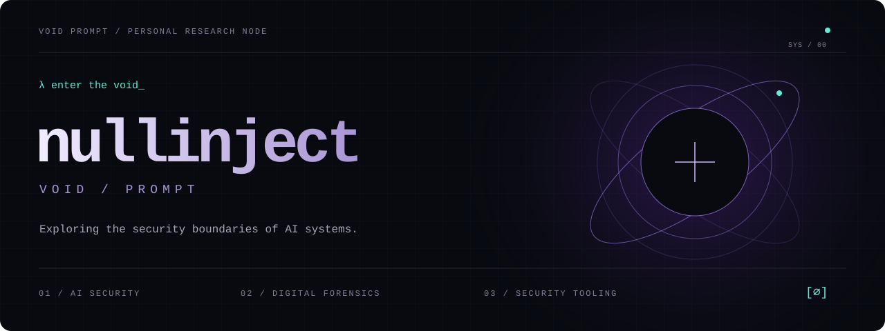

<p align="center">
  
</p>

<p align="center">
  <a href="#identity">Identity</a> &nbsp; / &nbsp;
  <a href="#projects">Projects</a> &nbsp; / &nbsp;
  <a href="#field-notes">Field Notes</a>
</p>

<br>

<a name="identity"></a>

### λ whoami

**我是 nullinject，也叫 Void Prompt。**

关注 LLM、RAG 与 Agent 的安全边界，也探索 AI 在数字取证中的应用。这里记录我的研究、实验复盘，以及正在构建的安全工具。

```text
void:~$ cat interests.conf

[ research ]
  prompt injection
  RAG poisoning
  agent trust boundaries

[ forensics ]
  memory analysis
  evidence validation

[ building ]
  security tools
  AI workflows
```

<br>

<a name="projects"></a>

### λ ls ./projects

#### 01 / LLM Security Research

**研究不可信输入如何跨越信任边界。**

LLM 应用与 AI 工具生态的安全研究与案例复盘，涵盖提示注入、RAG 投毒及 Skill 供应链安全。

`RESEARCH` `LLM SECURITY`

[阅读研究 →](https://github.com/nullinject/llm-security-research)

#### 02 / MemoryAI Forensics

**把内存证据串成可复盘的调查流程。**

AI 驱动的内存取证平台，结合工作流编排、Volatility 与 YARA，关注证据交叉验证与报告输出。

`SHOWCASE` `DIGITAL FORENSICS`

[查看项目 →](https://github.com/nullinject/MemoryAI-Forensics-Showcase)

*公开仓库为项目展示，完整实现位于私有仓库。*

#### 03 / ShadowProbe

安全产品识别工具。 &nbsp; `PYTHON` `SECURITY TOOLING`  
[探索工具 →](https://github.com/nullinject/shadowprobe)

<br>

<a name="field-notes"></a>

### λ cat ./field-notes

> **01 — 当检索内容成为指令**  
> RAG 文档投毒、间接提示注入，以及对 Agent 工具调用的影响。  
> [阅读案例 ↗](https://github.com/nullinject/llm-security-research/blob/main/RAG-Indirect-Prompt-Injection.md)

> **02 — 当扩展能力引入新的信任问题**  
> 从 Agent Skill 供应链审视执行权限与安全边界。  
> [阅读案例 ↗](https://github.com/nullinject/llm-security-research/blob/main/OpenClaw-Skill-Supply-Chain-Attack.md)

<br>

---

<p align="center">
  <samp>signal from the void.</samp><br><br>
  <sub>欢迎通过相关项目的 Issues 交流研究思路、实现细节与改进建议。</sub>
</p>
